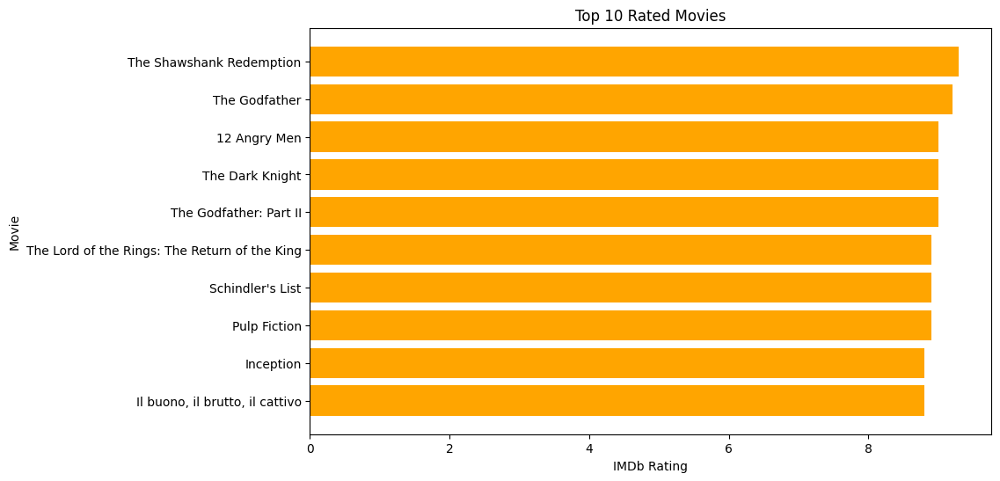
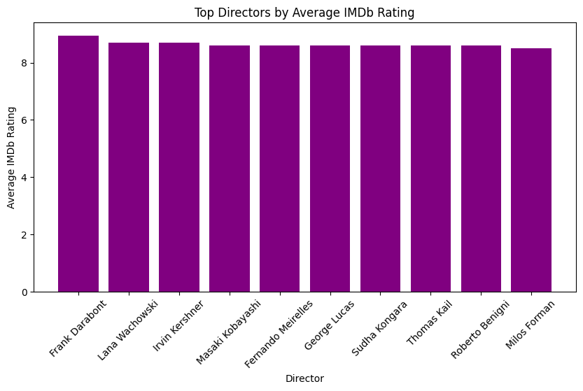
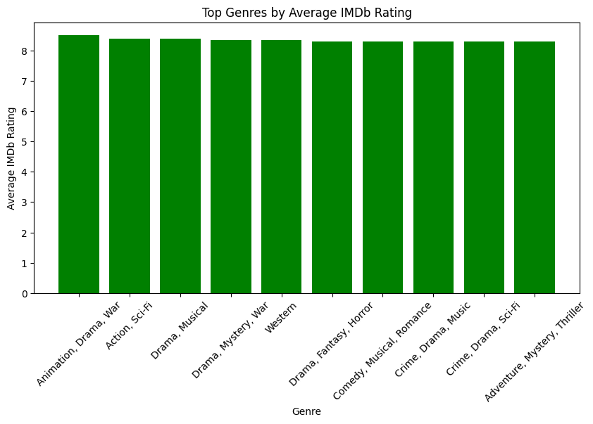
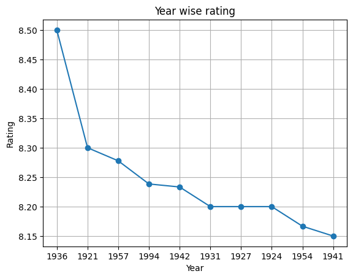
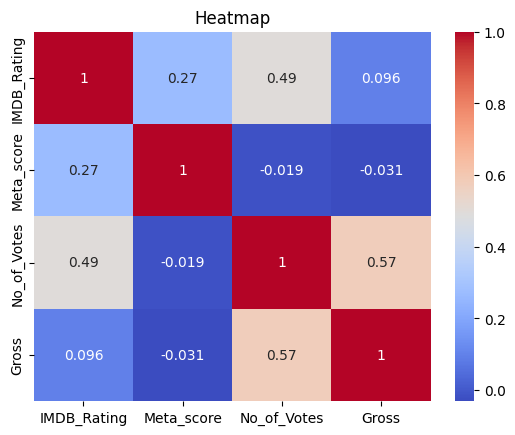
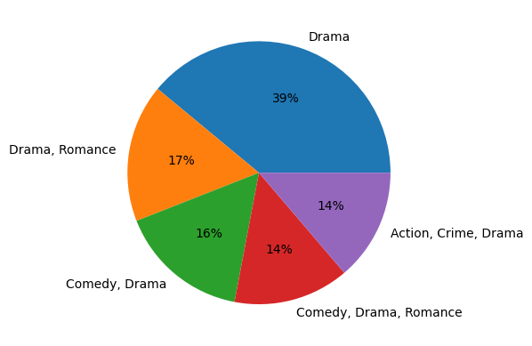

# 🎬 IMDb Top 1000 Movies Analysis using Python

## 📌 Project Overview

This project performs an Exploratory Data Analysis (EDA) on the IMDb Top 1000 Movies dataset using Python. The objective is to analyze movie ratings, genres, directors, release years, votes, and gross revenue to identify patterns and generate meaningful insights through data visualization.

The analysis was completed in Google Colab using Python data analysis libraries.

---

## 🎯 Objectives

- Analyze IMDb ratings across different movie genres.
- Identify the highest-rated movies and directors.
- Explore trends in movie ratings over the years.
- Examine relationships between ratings, votes, metascore, and gross revenue.
- Create visualizations to communicate key findings effectively.

---

## 📂 Dataset

**Dataset Name:** `imdb_top_1000.csv`

**Source:* Real World dataset

The dataset contains information about the IMDb Top 1000 movies, including:

- Movie Title
- Genre
- Director
- Release Year
- IMDb Rating
- Meta Score
- Number of Votes
- Gross Revenue
- Runtime
- Certificate
- Overview
- Stars

---

## 🛠️ Technologies Used

- Python
- Google Colab
- NumPy
- Pandas
- Matplotlib
- Seaborn

---

## 📊 Analysis Performed

This project includes the following analyses:

- Data loading and preprocessing
- Data cleaning and handling missing values
- Genre-wise average IMDb rating analysis
- Top-rated movie identification
- Top genres based on IMDb ratings
- Top directors by average IMDb rating
- IMDb rating trends over the years
- Gross revenue vs IMDb rating analysis
- Correlation analysis using Heatmap
- Distribution analysis of movie genres

---

## 📈 Visualizations

The project contains multiple visualizations, including:

## 📈 Visualizations

### ⭐ Top 10 Rated Movies

Displays the top 10 highest-rated movies in the IMDb Top 1000 dataset.



---

### 🎬 Top Directors by Average IMDb Rating

Shows the directors with the highest average IMDb ratings based on the dataset.



---

### 🎭 Top Genres by Average IMDb Rating

Compares movie genres based on their average IMDb ratings.



---

### 📅 IMDb Rating Trend Over Years

Visualizes the trend of average IMDb ratings across different release years.



---

### 🔥 Correlation Heatmap

Illustrates the correlation between IMDb Rating, Meta Score, Number of Votes, and Gross Revenue.



---

### 🥧 Genre Distribution

Displays the distribution of movie genres within the IMDb Top 1000 dataset.



---

## 🔍 Key Insights

- **The Shawshank Redemption** achieved the highest IMDb rating among the movies analyzed.
- Several genres consistently maintain an average IMDb rating above **8.0**, indicating strong audience appreciation.
- Legendary directors such as **Frank Darabont** rank among the highest based on average IMDb ratings.
- Movie ratings remained relatively stable across release years with only minor fluctuations.
- Gross revenue shows only a weak relationship with IMDb ratings, suggesting that higher box office earnings do not necessarily correspond to higher audience ratings.
- Number of votes exhibits a stronger positive relationship with gross revenue than IMDb ratings.

---

## 📁 Project Structure

```
Movie-Ratings-Analysis/
│
├── Movie_Ratings_Analysis.ipynb
├── imdb_top_1000.csv
├── README.md
│
├── images/
│   ├── top_10_movies.png
│   ├── genre_avg_rating.png
│   ├── top_genres.png
│   ├── top_directors.png
│   ├── yearly_rating_trend.png
│   ├── gross_vs_rating.png
│   ├── heatmap.png
│   └── genre_distribution.png
```

---

## 💡 Skills Demonstrated

- Exploratory Data Analysis (EDA)
- Data Cleaning
- Data Manipulation using Pandas
- Statistical Analysis
- Data Visualization
- Business Insight Generation
- Python Programming

---

## 🚀 Future Improvements

- Build an interactive dashboard using Power BI or Tableau.
- Perform sentiment analysis using movie descriptions.
- Predict IMDb ratings using Machine Learning models.
- Deploy the project as an interactive web application using Streamlit.

---

## 📷 Sample Visualizations

Add your chart screenshots inside the **images** folder and reference them here.

Example:

```md
### Top 10 Rated Movies


### Correlation Heatmap


```

---

## 👨‍💻 Author

**K V Anjani Kumar**

Aspiring Data Analyst | Python | SQL | Excel | Power BI

---
